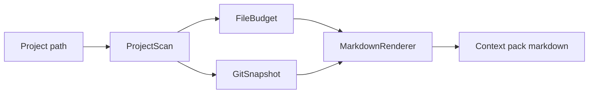

# Architecture

`context-pack-builder` is a local Ruby CLI that turns a repository into a compact Markdown context pack.

The implementation has five small pieces:

- `CLI`: parses project path, output path, and file budget.
- `ProjectScan`: detects high-signal files, README command snippets, CI files, sensitive-file warnings, and Git state.
- `FileBudget`: reads selected files with a per-file character cap and omits common local/generated/sensitive paths.
- `GitSnapshot`: records branch, dirty status, and recent commits.
- `MarkdownRenderer`: renders the scan into a pasteable context pack for AI models.

## Data Flow

## Boundary

The builder does not summarize arbitrary source code, execute project commands, or inspect secret values. It selects the files that normally define operating context: README, decisions, architecture, case study, learning journal, manifests, CI, OpenAPI, Docker, and Railway files.

Sensitive file handling is filename-based. The builder warns when common sensitive local files exist, but it is not a complete secret scanner.
